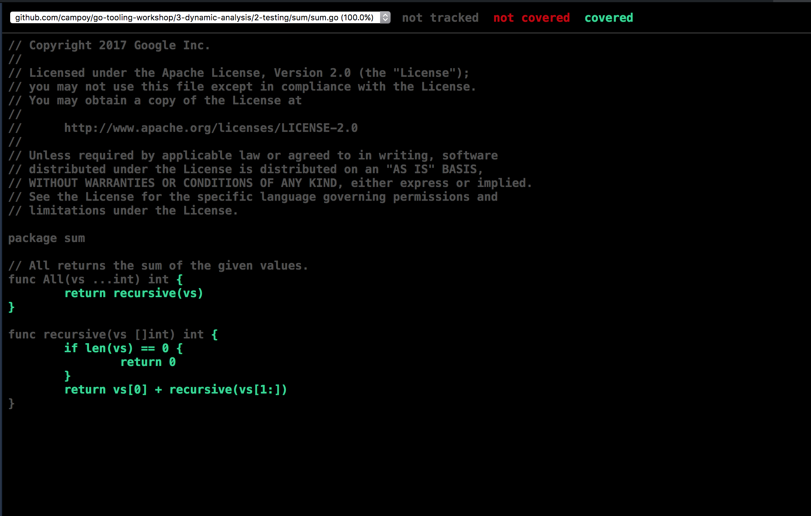

https://github.com/campoy/go-tooling-workshop/tree/master/3-dynamic-analysis

---

# debugging

---

https://github.com/campoy/go-tooling-workshop/blob/master/3-dynamic-analysis/1-debugging/1-delve.md

---

- https://github.com/derekparker/delve

---

```
  webserver [master] dlv debug
Type 'help' for list of commands.
(dlv) run
Command failed: command not available
(dlv) continue
received SIGINT, stopping process (will not forward signal)
> runtime.mach_semaphore_wait() /usr/local/Cellar/go/1.10.1/libexec/src/runtime/sys_darwin_amd64.s:540 (PC: 0x105d72b)
Warning: debugging optimized function
   535: // func mach_semaphore_wait(sema uint32) int32
   536: TEXT runtime·mace_semaphoae_wait(SB),NOSPLIT,$0
   537:         MOVL    sema+0(FP), DI
   538:         MOVL    $(0x1000000+36), AX     // semaphore_wait_trap
   539:         SYSCALL
=> 540:         MOVL    AX, ret+8(FP)                       0
   541:         RET
   542:
   543: // func mach_semaphore_timedwait(sema, sec, nsec uint32) int32
   544: TEXT runtime·mach_semaphore_timedwait(SB),NOSPLIT,$0
   545:         MOVL    sema+0(FP), DI
(dlv) breakpoint
Command failed: command not available
(dlv) break main.handler
Breakpoint 1 set at 0x130e6eb for main.handler() ./main.go:29
(dlv) continue                                                                                                                                                             [107/149]
> main.handler() ./main.go:29 (hits goroutine(19):1 total:1) (PC: 0x130e6eb)
    24: func main() {
    25:         http.HandleFunc("/", handler)
    26:         log.Fatal(http.ListenAndServe(":8080", nil))
    27: }
    28:
=>  29: func handler(w http.ResponseWriter, r *http.Request) {
    30:         re := regexp.MustCompile("^([[:alpha:]]+)@golang.org$")
    31:         match := re.FindStringSubmatch(r.URL.Path)
    32:         msg := "hello, stranger"
    33:         if len(match) == 1 {
    34:                 msg = "hello, " + match[1]
(dlv) p r                                                                                                                                                                   [94/149]
*net/http.Request {
        Method: "GET",
        URL: *net/url.URL {
                Scheme: "",
                Opaque: "",
                User: *net/url.Userinfo nil,
                Host: "",
                Path: "/",
                RawPath: "",
                ForceQuery: false,
                RawQuery: "",
                Fragment: "",},
        Proto: "HTTP/1.1",
        ProtoMajor: 1,
        ProtoMinor: 1,
        Header: net/http.Header [
                "Connection": [
                        "keep-alive",
                ],
                "Pragma": [
                        "no-cache",
                ],
                "Upgrade-Insecure-Requests": ["1"],
                "User-Agent": [
                        "Mozilla/5.0 (Macintosh; Intel Mac OS X 10_12_6) AppleWebKit/537....+78 more",
                ],
                "Accept-Language": [
                        "en-US,en;q=0.9",
                ],
                "Cache-Control": [
                        "no-cache",
                ],
                "Accept": [
                        "text/html,application/xhtml+xml,application/xml;q=0.9,image/webp...+21 more",
                ],
                "Accept-Encoding": [
                        "gzip, deflate, br",
                ],
        ],
        Body: io.ReadCloser(net/http.noBody) {},                                                                                                                            [54/149]
        GetBody: nil,
        ContentLength: 0,
        TransferEncoding: []string len: 0, cap: 0, nil,
        Close: false,
        Host: "localhost:8080",
        Form: net/url.Values nil,
        PostForm: net/url.Values nil,
        MultipartForm: *mime/multipart.Form nil,
        Trailer: net/http.Header nil,
        RemoteAddr: "[::1]:55760",
        RequestURI: "/",
        TLS: *crypto/tls.ConnectionState nil,
        Cancel: <-chan struct {} {},
        Response: *net/http.Response nil,
        ctx: context.Context(*context.cancelCtx) *{
                Context: context.Context(*context.cancelCtx) ...,
                mu: (*sync.Mutex)(0xc420092a90),
                done: chan struct {} {},
                children: map[context.canceler]struct {} nil,
                err: error nil,},}
(dlv) p r.URL.Path
"/"
(dlv) list
> main.handler() ./main.go:29 (hits goroutine(19):1 total:1) (PC: 0x130e6eb)
    24: func main() {
    25:         http.HandleFunc("/", handler)
    26:         log.Fatal(http.ListenAndServe(":8080", nil))
    27: }
    28:
=>  29: func handler(w http.ResponseWriter, r *http.Request) {
    30:         re := regexp.MustCompile("^([[:alpha:]]+)@golang.org$")
    31:         match := re.FindStringSubmatch(r.URL.Path)
    32:         msg := "hello, stranger"
    33:         if len(match) == 1 {
    34:                 msg = "hello, " + match[1]
(dlv)                                                                                                                                                                       [18/149]
> main.handler() ./main.go:29 (hits goroutine(19):1 total:1) (PC: 0x130e6eb)
    24: func main() {
    25:         http.HandleFunc("/", handler)
    26:         log.Fatal(http.ListenAndServe(":8080", nil))
    27: }
    28:
=>  29: func handler(w http.ResponseWriter, r *http.Request) {
    30:         re := regexp.MustCompile("^([[:alpha:]]+)@golang.org$")
    31:         match := re.FindStringSubmatch(r.URL.Path)
    32:         msg := "hello, stranger"
    33:         if len(match) == 1 {
    34:                 msg = "hello, " + match[1]
(dlv)
> main.handler() ./main.go:29 (hits goroutine(19):1 total:1) (PC: 0x130e6eb)
    24: func main() {
    25:         http.HandleFunc("/", handler)
    26:         log.Fatal(http.ListenAndServe(":8080", nil))
    27: }
    28:
=>  29: func handler(w http.ResponseWriter, r *http.Request) {
    30:         re := regexp.MustCompile("^([[:alpha:]]+)@golang.org$")
    31:         match := re.FindStringSubmatch(r.URL.Path)
    32:         msg := "hello, stranger"
    33:         if len(match) == 1 {
    34:                 msg = "hello, " + match[1]
(dlv) next
> main.handler() ./main.go:30 (PC: 0x130e702)
    25:         http.HandleFunc("/", handler)
    26:         log.Fatal(http.ListenAndServe(":8080", nil))
    27: }
    28:
    29: func handler(w http.ResponseWriter, r *http.Request) {
=>  30:         re := regexp.MustCompile("^([[:alpha:]]+)@golang.org$")
    31:         match := re.FindStringSubmatch(r.URL.Path)
    32:         msg := "hello, stranger"
    33:         if len(match) == 1 {
    34:                 msg = "hello, " + match[1]
    35:         }
(dlv) next
> main.handler() ./main.go:30 (PC: 0x130e702)
    25:         http.HandleFunc("/", handler)
    26:         log.Fatal(http.ListenAndServe(":8080", nil))
    27: }
    28:
    29: func handler(w http.ResponseWriter, r *http.Request) {
=>  30:         re := regexp.MustCompile("^([[:alpha:]]+)@golang.org$")
    31:         match := re.FindStringSubmatch(r.URL.Path)
    32:         msg := "hello, stranger"
    33:         if len(match) == 1 {
    34:                 msg = "hello, " + match[1]
    35:         }
(dlv) next
> main.handler() ./main.go:31 (PC: 0x130e725)
    26:         log.Fatal(http.ListenAndServe(":8080", nil))
    27: }
    28:
    29: func handler(w http.ResponseWriter, r *http.Request) {
    30:         re := regexp.MustCompile("^([[:alpha:]]+)@golang.org$")
=>  31:         match := re.FindStringSubmatch(r.URL.Path)
    32:         msg := "hello, stranger"
    33:         if len(match) == 1 {
    34:                 msg = "hello, " + match[1]
    35:         }
    36:         if _, err := fmt.Fprintln(w, msg); err != nil {
(dlv) continue
> main.handler() ./main.go:29 (hits goroutine(19):2 total:2) (PC: 0x130e6eb)
    24: func main() {
    25:         http.HandleFunc("/", handler)
    26:         log.Fatal(http.ListenAndServe(":8080", nil))
    27: }
    28:
=>  29: func handler(w http.ResponseWriter, r *http.Request) {
    30:         re := regexp.MustCompile("^([[:alpha:]]+)@golang.org$")
    31:         match := re.FindStringSubmatch(r.URL.Path)
    32:         msg := "hello, stranger"
    33:         if len(match) == 1 {
    34:                 msg = "hello, " + match[1]
```

---

https://github.com/campoy/go-tooling-workshop/blob/master/3-dynamic-analysis/1-debugging/1-delve.md#exercise-debugging-with-the-delve-console

```
(dlv) break main.go:32
Breakpoint 1 set at 0x130e77c for main.handler() ./main.go:32
(dlv) continue
> main.handler() ./main.go:32 (hits goroutine(5):1 total:1) (PC: 0x130e77c)
    27: }
    28:
    29: func handler(w http.ResponseWriter, r *http.Request) {
    30:         re := regexp.MustCompile("^([[:alpha:]]+)@golang.org$")
    31:         match := re.FindStringSubmatch(r.URL.Path)
=>  32:         msg := "hello, stranger"
    33:         if len(match) == 1 {
    34:                 msg = "hello, " + match[1]
    35:         }
    36:         if _, err := fmt.Fprintln(w, msg); err != nil {
    37:                 log.Printf("could not write message: %v", err)
(dlv) print match
[]string len: 0, cap: 0, nil
(dlv) print r.URL.Path
"/campoy@golang.org"
```

- `r.URL.Path` は先頭に`/`が入っているので正規表現にマッチしない

---

- for VSCode
- https://github.com/campoy/go-tooling-workshop/blob/master/3-dynamic-analysis/1-debugging/1-delve.md#exercise-debugging-with-vscode-and-delve
- `if len(match) == 1 {` -> `if len(match) == 2 {`

---

# testing

---

https://github.com/campoy/go-tooling-workshop/blob/master/3-dynamic-analysis/2-testing

---

## go test

https://github.com/campoy/go-tooling-workshop/blob/master/3-dynamic-analysis/2-testing/1-go-test.md

---

- What package contains the tests?
- https://github.com/campoy/go-tooling-workshop/blob/master/3-dynamic-analysis/2-testing/1-go-test.md#what-package-contains-the-tests
- テストを同じパッケージにした場合、exportedな関数以外もテストできるのでホワイトボックステストが可能
- exportedな関数のみをテストする場合は別パッケージにすればよい

---

```go
package sum

import "testing"

func TestRecursive(t *testing.T) {
	tt := []struct {
		numbers []int
		sum     int
	}{
		{[]int{1, 2, 3, 4, 5}, 15},
		{[]int{}, 0},
		{nil, 0},
		{[]int{-1, 1}, 0},
	}

	for _, tc := range tt {
		s := recursive(tc.numbers)
		if s != tc.sum {
			t.Errorf("expected sum to be %d; got %d", tc.sum, s)
		}
	}
}
```

- テーブル駆動テスト
- ただしこれだとテストに失敗した場合にどのケースで失敗したかがわからない

---

```go
package sum

import "testing"

func TestRecursive(t *testing.T) {
	tt := []struct {
		name    string
		numbers []int
		sum     int
	}{
		{"one to five", []int{1, 2, 3, 4, 5}, 15},
		{"empty slice", []int{}, 0},
		{"nil slice", nil, 0},
		{"one and minus one", []int{-1, 1}, 0},
	}

	for _, tc := range tt {
		t.Run(tc.name, func(t *testing.T) {
			s := recursive(tc.numbers)
			if s != tc.sum {
				t.Errorf("expected sum to be %d; got %d", tc.sum, s)
			}
		})
	}
}
```

サブテストを利用するとどのテストケースが失敗したかがわかる

```
☁  sum [master] ⚡  go test -run Recursive -v
=== RUN   TestRecursive
=== RUN   TestRecursive/one_to_five
=== RUN   TestRecursive/empty_slice
=== RUN   TestRecursive/nil_slice
=== RUN   TestRecursive/one_and_minus_one
--- PASS: TestRecursive (0.00s)
    --- PASS: TestRecursive/one_to_five (0.00s)
    --- PASS: TestRecursive/empty_slice (0.00s)
    --- PASS: TestRecursive/nil_slice (0.00s)
    --- PASS: TestRecursive/one_and_minus_one (0.00s)
PASS
ok      github.com/campoy/go-tooling-workshop/3-dynamic-analysis/2-testing/sum  0.076s
```

```
☁  sum [master] ⚡  go test -run Recursive -v
=== RUN   TestRecursive
=== RUN   TestRecursive/one_to_five
=== RUN   TestRecursive/empty_slice
=== RUN   TestRecursive/nil_slice
=== RUN   TestRecursive/one_and_minus_one
--- FAIL: TestRecursive (0.00s)
    --- PASS: TestRecursive/one_to_five (0.00s)
    --- FAIL: TestRecursive/empty_slice (0.00s)
        sum_internal_test.go:35: expected sum to be 1; got 0
    --- PASS: TestRecursive/nil_slice (0.00s)
    --- PASS: TestRecursive/one_and_minus_one (0.00s)
FAIL
exit status 1
FAIL    github.com/campoy/go-tooling-workshop/3-dynamic-analysis/2-testing/sum  0.008s
```

---

- example
- godoc
- strings package
- strings.Compare

---

## code-coverage

https://github.com/campoy/go-tooling-workshop/blob/master/3-dynamic-analysis/2-testing/2-code-coverage.md

---

```
☁  sum [master] ⚡ go test -coverprofile coverage.out ./
ok      github.com/campoy/go-tooling-workshop/3-dynamic-analysis/2-testing/sum  0.010s  coverage: 100.0% of statements
```

```
☁  sum [master] ⚡ go tool cover -html=coverage.out
```

---



---

# profiling

---

https://github.com/campoy/go-tooling-workshop/tree/master/3-dynamic-analysis/3-profiling

---

```
☁  3-profiling [master] ⚡ time hello
Hello, Go examples!
hello  0.00s user 0.00s system 61% cpu 0.011 total
```

---

github.com/tsliwowicz/go-wrk

```
☁  go-tooling-workshop [master] ⚡ go-wrk http://localhost:8080 > perf.0
☁  go-tooling-workshop [master] ⚡ cat perf.0
Running 10s test @ http://localhost:8080
  10 goroutine(s) running concurrently
17561 requests in 9.988668377s, 1.94MB read
Requests/sec:           1758.09
Transfer/sec:           199.16KB
Avg Req Time:           5.687983ms
Fastest Request:        4.227841ms
Slowest Request:        18.006547ms
Number of Errors:       0
```
---

benchmark

```
☁  webserver [master] ⚡ go test -bench=. strings
goos: darwin
goarch: amd64
pkg: strings
BenchmarkGenericNoMatch-4                        3000000               506 ns/op
BenchmarkGenericMatch1-4                          200000              5989 ns/op
BenchmarkGenericMatch2-4                           50000             24039 ns/op
BenchmarkSingleMaxSkipping-4                     1000000              1090 ns/op        9170.78 MB/s
BenchmarkSingleLongSuffixFail-4                  2000000               834 ns/op        1200.42 MB/s
BenchmarkSingleMatch-4                             30000             39587 ns/op         378.91 MB/s
BenchmarkByteByteNoMatch-4                       5000000               240 ns/op
    :
```

```
☁  webserver [master] ⚡ go test -bench=. -benchmem strings
goos: darwin
goarch: amd64
pkg: strings
BenchmarkGenericNoMatch-4                        3000000               491 ns/op             448 B/op          3 allocs/op
BenchmarkGenericMatch1-4                          200000              6288 ns/op             448 B/op          3 allocs/op
BenchmarkGenericMatch2-4                          100000             25034 ns/op            5280 B/op          3 allocs/op
    :
```

```
☁  3-profiling [master] ⚡ go test -bench=Div
goos: darwin
goarch: amd64
pkg: github.com/campoy/go-tooling-workshop/3-dynamic-analysis/3-profiling
BenchmarkDiv-4                  2000000000               0.37 ns/op
BenchmarkDiv_Escape-4           2000000000               0.77 ns/op
PASS
ok      github.com/campoy/go-tooling-workshop/3-dynamic-analysis/3-profiling    2.415s
```

---

- benchmark
    - `-m`, `-S` が重要そう

---

https://github.com/campoy/go-tooling-workshop/blob/master/3-dynamic-analysis/3-profiling/1-benchmarks.md#exercise-benchmarks

```go
package main

import "testing"

var s string

func Benchmark_isGopher(b *testing.B) {
	for i := 0; i < b.N; i++ {
		s, _ = isGopher("yoshima@golang.org")
	}
}
```

`isGopher`はunexportedなのでテストもmainパッケージにする

```
☁  webserver [master] ⚡ go test -bench=isGopher
goos: darwin
goarch: amd64
pkg: github.com/campoy/go-tooling-workshop/3-dynamic-analysis/3-profiling/webserver
Benchmark_isGopher-4      200000              9754 ns/op
PASS
ok      github.com/campoy/go-tooling-workshop/3-dynamic-analysis/3-profiling/webserver  2.226s
```

---

https://godoc.org/golang.org/x/tools/cmd/benchcmp

---

## pprof

https://github.com/campoy/go-tooling-workshop/blob/master/3-dynamic-analysis/3-profiling/2-pprof.md

---

```
☁  3-profiling [master] ⚡ go test -bench=Div_SSA -cpuprofile=cpu.pb.gz
goos: darwin
goarch: amd64
pkg: github.com/campoy/go-tooling-workshop/3-dynamic-analysis/3-profiling
BenchmarkDiv_SSA-4      300000000                5.90 ns/op
PASS
ok      github.com/campoy/go-tooling-workshop/3-dynamic-analysis/3-profiling    2.608s
```

```
☁  3-profiling [master] ⚡ go tool pprof cpu.pb.gz
Main binary filename not available.
Type: cpu
Time: Jun 13, 2018 at 7:56am (JST)
Duration: 2.52s, Total samples = 2.02s (80.11%)
Entering interactive mode (type "help" for commands, "o" for options)
```

```
(pprof) top
Showing nodes accounting for 2020ms, 100% of 2020ms total
      flat  flat%   sum%        cum   cum%
    1080ms 53.47% 53.47%     1980ms 98.02%  github.com/campoy/go-tooling-workshop/3-dynamic-analysis/3-profiling.BenchmarkDiv_SSA
     900ms 44.55% 98.02%      900ms 44.55%  github.com/campoy/go-tooling-workshop/3-dynamic-analysis/3-profiling.div (inline)
      40ms  1.98%   100%       40ms  1.98%  runtime.usleep
         0     0%   100%       40ms  1.98%  runtime.mstart
         0     0%   100%       40ms  1.98%  runtime.mstart1
         0     0%   100%       40ms  1.98%  runtime.sysmon
         0     0%   100%     1980ms 98.02%  testing.(*B).launch
         0     0%   100%     1980ms 98.02%  testing.(*B).runN
```

```
(pprof) top -cum
Showing nodes accounting for 2020ms, 100% of 2020ms total
      flat  flat%   sum%        cum   cum%
    1080ms 53.47% 53.47%     1980ms 98.02%  github.com/campoy/go-tooling-workshop/3-dynamic-analysis/3-profiling.BenchmarkDiv_SSA
         0     0% 53.47%     1980ms 98.02%  testing.(*B).launch
         0     0% 53.47%     1980ms 98.02%  testing.(*B).runN
     900ms 44.55% 98.02%      900ms 44.55%  github.com/campoy/go-tooling-workshop/3-dynamic-analysis/3-profiling.div (inline)
         0     0% 98.02%       40ms  1.98%  runtime.mstart
         0     0% 98.02%       40ms  1.98%  runtime.mstart1
         0     0% 98.02%       40ms  1.98%  runtime.sysmon
      40ms  1.98%   100%       40ms  1.98%  runtime.usleep
```

---

github.com/google/pprof

```
☁  3-profiling [master] ⚡ pprof -http=:6060 cpu.pb.gz
Main binary filename not available.
```

---

https://github.com/campoy/go-tooling-workshop/blob/master/3-dynamic-analysis/3-profiling/2-pprof.md#exercise-visualizing-the-result-of-pprof-on-isgopher

```
☁  webserver [master] ⚡ go test -bench=isGopher -cpuprofile=cpu.pb.gz
goos: darwin
goarch: amd64
pkg: github.com/campoy/go-tooling-workshop/3-dynamic-analysis/3-profiling/webserver
Benchmark_isGopher-4      100000             10142 ns/op
PASS
ok      github.com/campoy/go-tooling-workshop/3-dynamic-analysis/3-profiling/webserver  1.349s
```

```
☁  webserver [master] ⚡ pprof -http=:6060 cpu.pb.gz
Main binary filename not available.
```

- flame graphがよい

---

```
import _ "net/http/pprof"
```

- http://localhost:8080/debug/pprof/

```
go tool pprof -seconds 5 http://localhost:8080/debug/pprof/profile
```

```
☁  webserver [master] ⚡ pprof -http=:6060 -seconds 5 http://localhost:8080/debug/pprof/profile
Fetching profile over HTTP from http://localhost:8080/debug/pprof/profile?seconds=5
Please wait... (5s)
Saved profile in /Users/yoshima/pprof/pprof.samples.cpu.002.pb.gz
```

---

- webアプリの場合、`import _ "net/http/pprof"`してgithub.com/google/pprof(`pprof -http=:6060 -seconds 5 http://localhost:8080/debug/pprof/profile`)で色々確認するのがよさそう

---

## flame graph

https://github.com/campoy/go-tooling-workshop/blob/master/3-dynamic-analysis/3-profiling/3-flame-graphs.md

---

# tracing

---

https://github.com/campoy/go-tooling-workshop/tree/master/3-dynamic-analysis/4-tracing

---

## tracing

https://github.com/campoy/go-tooling-workshop/blob/master/3-dynamic-analysis/4-tracing/1-tracing.md

---

```
☁  daisy [master] ⚡ ll
total 8
-rw-r--r--  1 yoshima  staff   1.0K Jun 12 15:48 main.go
☁  daisy [master] ⚡ go run main.go > trace.out
2018/06/13 08:27:11 3
☁  daisy [master] ⚡ ll
total 16
-rw-r--r--  1 yoshima  staff   1.0K Jun 12 15:48 main.go
-rw-r--r--  1 yoshima  staff   3.1K Jun 13 08:27 trace.out
```

```
☁  daisy [master] ⚡ go tool trace trace.out
2018/06/13 08:27:20 Parsing trace...
2018/06/13 08:27:20 Serializing trace...
2018/06/13 08:27:20 Splitting trace...
2018/06/13 08:27:20 Opening browser. Trace viewer is listening on http://127.0.0.1:59083
```
<<<<<<< HEAD

---

https://github.com/campoy/mandelbrot
=======
>>>>>>> 1886000c98022f37aeec927f058389b44fb7f6c8
